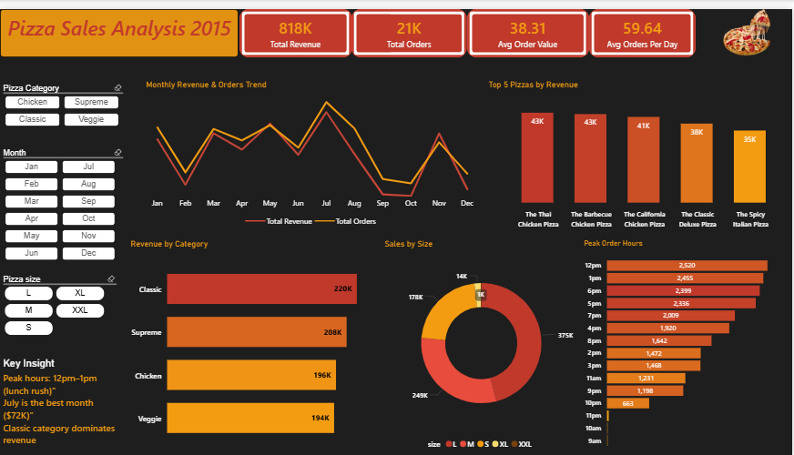

# 🍕 Pizza Sales Analysis 2015

## 📊 Project Overview
An end-to-end data analysis project analyzing 21,350 pizza orders 
using PostgreSQL for data extraction and querying, and Power BI 
for dashboard visualization and storytelling.

## 📸 Dashboard Preview

## 🛠️ Tools Used
- **PostgreSQL** — Database design, data import, SQL queries
- **Power BI** — Dashboard, DAX measures, conditional formatting
- **pgAdmin 4** — Database management

## 🗄️ Database Schema
4 tables connected via foreign keys:
- `pizza_types` — Pizza menu categories and ingredients
- `pizzas` — Pizza sizes and prices
- `orders` — Order date and time
- `order_details` — Order line items and quantities

## 📈 Key KPIs
| Metric | Value |
|---|---|
| Total Revenue | $817,860 |
| Total Orders | 21,350 |
| Avg Order Value | $38.31 |
| Avg Orders Per Day | 59.64 |

## 🔍 Key Insights

**Monthly Trend**
- July led all months with 4,301 orders and $72,558 revenue — the highest of 2015
- October hit the lowest at $64,028 — an $8,530 gap vs. July, signaling a seasonal slowdown
- Orders and revenue move in lockstep across all 12 months — confirming average order value stays consistent year-round

**Peak Order Hours**
- 12–13 capture the lunch rush and 17–20 drive the evening spike — together accounting for the majority of daily orders
- Friday dominates across both windows — prioritize staffing and prep on Fridays

**Top Pizzas**
- Classic Deluxe Pizza leads with 2,416 orders — outselling 5th-place Spicy Italian by 529 orders
- Top 4 pizzas are within 114 orders of each other — menu variety drives balanced demand

**Category Performance**
- Classic dominates with 14,579 orders — 35% more than Chicken's 10,815
- Supreme and Veggie sit close at 11,777 and 11,449 — customers split evenly between meat and vegetarian

**Size Preference**
- Large leads with 18,526 orders — 20% ahead of Medium (15,385)
- XL and XXL together account for just 572 orders out of 48,620 — strong case for discontinuing both sizes

## 📊 Dashboard Features
- Monthly revenue and orders trend line chart
- Day × Hour heatmap matrix with orange gradient conditional formatting
- Top 5 pizzas by total orders
- Orders by category (horizontal bar)
- Sales by pizza size (donut chart)
- Insight annotations on every chart

## 💡 DAX Highlights
- `Total Orders = COUNTROWS('public order_details')`
- `Day = FORMAT('public orders'[date], "ddd")` — weekday name extraction
- `Day Sort = WEEKDAY('public orders'[date], 2)` — Monday=1 sort order
- `Pizza Name Clean = SUBSTITUTE('public pizza_types'[name], "The ", "")`
- Conditional formatting (background + font color) for heatmap gradient

## 💾 SQL Highlights
- Complex JOINs across 4 tables
- `EXTRACT(MONTH/HOUR FROM date)` for time-based analysis
- Window functions — `LAG()` for MOM% growth
- CTEs for average order calculations
- Aggregations: `COUNT`, `SUM(quantity * price)` for revenue

## 📁 Files
- `pizza_sales.sql` — Schema and analytical queries
- `pizza_analysis.pbix` — Power BI dashboard

## 🚀 How to Run
1. Create database `pizza_analysis_db` in PostgreSQL
2. Run `pizza_sales.sql` to create tables
3. Import CSV files in order:
   - pizza_types → pizzas → orders → order_details
4. Open `pizza_analysis.pbix` in Power BI Desktop
5. Update PostgreSQL connection credentials
